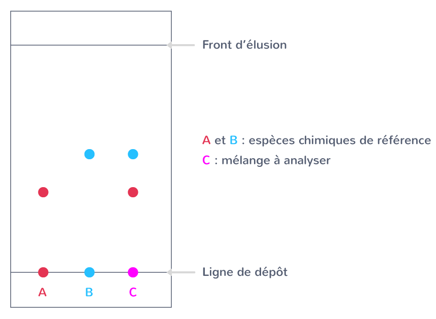
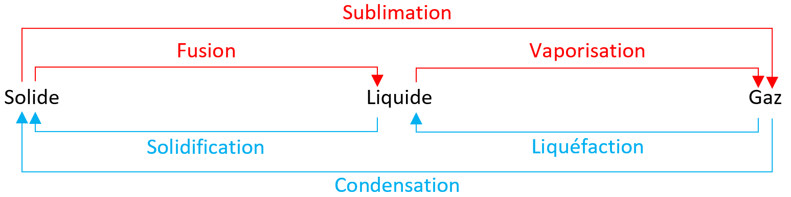
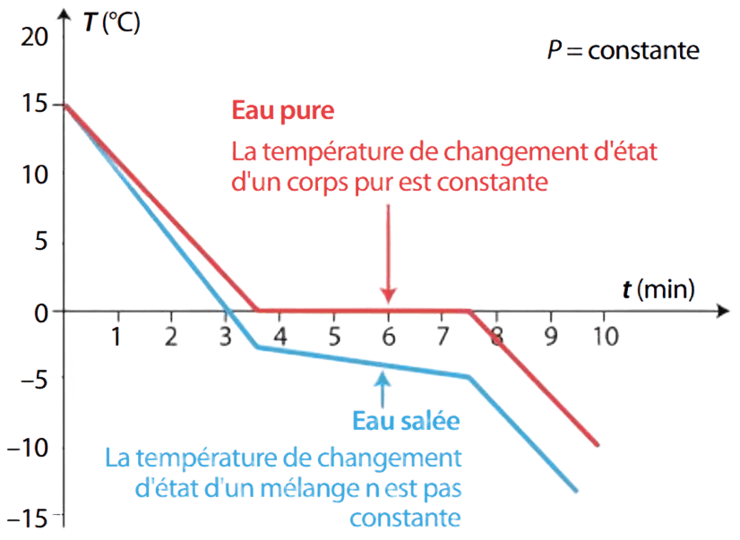

# Identification des espèces chimiques

## I. Corps pur et mélanges

!!! danger "Espèce chimique"
    Une **espèce chimique** correspond à un ensemble d'entités chimiques identiques entre elles et représentées par une même formule. Cela peut être un **atome**, une **molécule** ou un **ion**. 
    Une espèce chimique peut être symbolisée par une **formule chimique**.

??? note "Exemple :"
    Les espèces chimiques qui composent le sel de table sont les **ions chlorure**, de formule chimique ${Cl^{-}}$ et les **ions sodium** de formule chimique ${Na^{+}}$.  

!!! info "Remarque"
    L'état physique de l'espèce chimique peut être précisé dans sa formule chimique. Par exemple, pour l'eau de formule chimique $H_{2}O$ :

	* L'eau à l'état solide (glace) peut s'écrire $H_{2}O~_{ (s)}$.  
	
	* L'eau à l'état liquide peut s'écrire $H_{2}O~_{ (l)}$.
	
	* L'eau à l'état gazeux peut s'écrire $H_{2}O~_{(g)}$.

!!! danger "Corps pur"
    Un **corps pur** est une substance composée d'**une seule espèce chimique**.

??? note "Exemple :"
    L'**eau distillée** est un **corps pur**. Elle est seulement composée de plusieurs molécules d'eau, de formule chimique $H_{2}O$.

!!! danger "Mélanges"
    Un **mélange** est une substance composée de **plusieurs espèces chimiques** (au moins 2).  
    Il existe 2 types 2 mélange :  
        • Un mélange **homogène** s'il est **impossible de distinguer ses différents constituer à l'oeil nu**.  
        • Un mélange **hétérogène** s'il est **impossible de distinguer ses différents constituer à l'oeil nu**. On observe alors différentes parties du mélange, appelées **phase**.

??? note "Exemple :"
    Le mélange d'**eau** et de **sucre** est un mélange **homogène**.  
    Le mélange d'**eau** et d'**huile** est un mélange **hétérogène**.

## II. Composition d'un mélange

La description d'un mélange est donnée par sa composition en masse ou sa composition en volume des différentes espèces qui le composent.  
Un mélange peut être caractérisé par :  
• Sa **composition massique** qui indique les **pourcentages des masses** des différentes espèces qui le composent.  
• Sa **composition volumique** qui indique les **pourcentages des volumes** des différentes espèces qui le composent.

!!! note "Exemple de l'air :"
    L'air est un **mélange homogène** de différent gaz. Sa **composition volumique** est :  
    • 78% de diazote $N_2$ ;  
    • 21% de dioxygène $O_2$ ;  
    • 1% d'autres gaz (dioxyde de carbone $CO_2$, Argon $Ar$, etc...).

    Pour simplifier, on néglige les autres gaz et l'air est composé d'environ $\frac{4}{5}$ de diazote et $\frac{1}{5}$ de dioxygène.

## III. Identification d'espèces chimiques

### 1. Par des tests chimiques

Certaines espèces chimiques peuvent être mises en évidence à l'aide de tests d'identification facilement réalisables.

<table max-width=50%>
	<tr>
		<th>Espèce chimique</th>
		<th>Test d'identification</th>
		<th>Résultat positif si...</th>
	</tr>
	<tr>
		<td><b>Eau H2O</b></td>
		<td>Mettre en conctact l'échantillon à tester avec du sulfate de cuivre anhydre.</td>
		<td>Le sulfate de cuivre anhydre, initialement blanc, devient bleu.</td>
	</tr>
	<tr>
		<td><b>Dihydrogène H2</b></td>
		<td>Approcher une flamme de l'achantillon de gaz à tester.</td>
		<td>Production d'une détonation caractéristique, appelée "aboiement".</td>
	</tr>
	<tr>
		<td><b>Dioxygène O2</b></td>
		<td>Approcher une bûchette incandescente de l'achantillon de gaz à tester.</td>
		<td>La bûchette produit de nouveau une flamme.</td>
	</tr>
	<tr>
		<td><b>Dioxyde de carbone CO2</b></td>
        <td>Faire barboter l'échantillon de	gaz à tester dans de l'eau de chaux.</td>
        <td>L'eau de chaux se trouble et devient blanchâtre	</td>
	</tr>						
</table> 

### 2. Par chromatogtaphie (CCM)

La Chromatographie sur Couche Mince (CCM) permet la **séparation** et l'**identification** des espèces chimiques présentes dans un mélange. La figure obtenue par chromatographie est appelée **chromatogramme**.

!!! info "Méthodologie"
    Lecture verticale :  
		• Un **corps pur** ne présente qu'**une seule tâche** sur une même ligne verticale.  
		• Un **mélange** contient **plusieurs tâches** sur une même ligne verticale.  
    Lecture horizontale :  
		• Deux tâches situées à la **même hauteur** correspondent à une **même espèce chimique**.  
        • Deux tâches situées à des **hauteurs différentes** correpondent à des **espèces chimiques distinctes**.

??? note "Exemple :"
    { width=600; align=right }
    Le mélange C contient les deux espèces chimiques de référence A et B, car les dépôts ont migré jusqu'aux mêmes hauteurs que les espèces chimiques A et B.

### 3. Par des mesures physiques

#### a. Températures de changement d'état

!!! danger "Changement d'état"
    Un **changement d'état** est la transformation physique qui correspond au passage d'un état (solide, liquide ou gazeux) à un autre.

    { width=600; .center}

    Le **changement d'état** d'une espèce chimique s'effectue à **température constante**, qui est caractéristique de cette espèce chimique.  
    On peut donc définir une valeur de la température de changement d'état d'un corps pur, alors qu'on ne peut pas pour un mélange.

??? note "Exemple :"
    { width=400; align=right }

    La température de solidification de l'eau pure est précisemment à 0°C, tandis que la température de solidification de l'eau salée est inférieure à 0°C (on l'estime entre -3°C et -5°C).  
	Cela signifie d'onc que l'eau pure est un corps pur et l'eau salée est un mélange.
							

#### b. Masse volumique

!!! danger "Masse volumique"
	La **masse volumique $\rho$** d'un corps est le rapport de la **masse $m$** d'un échantillon de ce corps par le** volume $V$** qu'il occupe :  
    
 $\rho = \frac{m}{V}$ 

??? note "Exemple :"
    La masse d'un échantillon de fer de volume $V = 100 L$ est  $m = 786 kg$. Sa masse volumique est donc :  
    $\rho_{Fe} =\frac{m_{Fe}}{V_{Fe}}=\frac{786 kg}{100 L}=7,86~kg.L^{-1}=7,86~g.mL^{-1}$

!!! info "Remarque :"
    La comparaison de la masse volumique d'un corps non miscible à l'eau à la masse volumique de l'eau permet de prévoir la position relative de ce corps par rapport à celle de l'eau.  
	Si la masse volumique présente une variation par rapport à la valeur attendue, cela met en évidence la présence d'un mélange ou d'impuretés.

## IV. Travaux pratiques et exercices
<!--[Version PDF <i class="fa-regular fa-file-pdf fa-2xl" style="color:#de231a"></i>](chap1/TP - Identification par des tests chimiques - CORRIGE.pdf){target="_blank" rel="noopener" }  -->

    <table>
		<tr>
			<td rowspan="4" style="vertical-align:middle;text-align:center"><b>Travaux Pratiques</b></td>
			<td rowspan="2" style="vertical-align:middle;text-align:center">TP n°1 : Identification par des tests chimiques</td>
			<td style="vertical-align:middle;text-align:center">Enoncé</td>
			<td style="vertical-align:middle;text-align:center"><a href="https://drive.google.com/file/d/1E5AWILAkGUoWRbIvf8MIjInVxa6O-fDh/view?usp=sharing" target="_blank"> Version PDF <i class="fa-regular fa-file-pdf fa-2xl" style="color:#de231a"></i></a></td>
			<td style="vertical-align:middle;text-align:center"><a href="https://docs.google.com/document/d/1EA8s0S3wypGaSKuKLkCrYtdXfw7mrpph/edit?usp=drive_link&ouid=110183103573751255731&rtpof=true&sd=true" target="_blank">Version Word <i class="fa-regular fa-file-word fa-2xl"  style="color:#2a5599"></i></a></td>
		</tr>
		<tr>
			<td style="vertical-align:middle;text-align:center">Corrigé</td>
			<td style="vertical-align:middle;text-align:center"><a href="https://drive.google.com/file/d/1E5lVSyrP65J59Njptq89XjSdfXTllXRH/view?usp=drive_link" target="_blank">Version PDF <i class="fa-regular fa-file-pdf fa-2xl" style="color:#de231a"></i></a></td>
			<td style="vertical-align:middle;text-align:center"><a href="https://docs.google.com/document/d/1EGYEV21g4fhbWLy1ScEOu8RimFGmAUY2/edit?usp=drive_link&ouid=110183103573751255731&rtpof=true&sd=true" target="_blank">Version Word <i class="fa-regular fa-file-word fa-2xl"  style="color:#2a5599"></i></a></td>
		</tr>
		<tr>
			<td rowspan="2" style="vertical-align:middle;text-align:center">TP n°2 : Identification par des mesures physiques</td>
			<td style="vertical-align:middle;text-align:center">Enoncé</td>
			<td style="vertical-align:middle;text-align:center"><a href="https://drive.google.com/file/d/1DpirdpEsV_aoZ9xdAU4RRRodI9lYZlfP/view?usp=drive_link" target="_blank">Version PDF <i class="fa-regular fa-file-pdf fa-2xl" style="color:#de231a"></i></a></td>
			<td style="vertical-align:middle;text-align:center"><a href="https://docs.google.com/document/d/1E1ErrNDmhStS5EDXy-Momg5jrH97flsk/edit?usp=drive_link&ouid=110183103573751255731&rtpof=true&sd=true" target="_blank">Version Word <i class="fa-regular fa-file-word fa-2xl"  style="color:#2a5599"></i></a></td>
		</tr>
		<tr>
			<td style="vertical-align:middle;text-align:center">Corrigé</td>
			<td style="vertical-align:middle;text-align:center"><a href="https://drive.google.com/file/d/1DiJBAHoWOfAUDAQ-ZaFPynrZvtk7yeiV/view?usp=drive_link" target="_blank">Version PDF <i class="fa-regular fa-file-pdf fa-2xl" style="color:#de231a"></i></a></td>
			<td style="vertical-align:middle;text-align:center"><a href="https://docs.google.com/document/d/1DvxJWQV5xli4_OskcvqVAcIdz0Qi6mCr/edit?usp=drive_link&ouid=110183103573751255731&rtpof=true&sd=true" target="_blank">Version Word <i class="fa-regular fa-file-word fa-2xl"  style="color:#2a5599"></i></a></td>
		</tr>
		<tr>
			<td rowspan="2" style="vertical-align:middle;text-align:center"><b>Exercices</b></td>
			<td rowspan="2" style="vertical-align:middle;text-align:center">Exercices sur l'identification des espèces chimiques</td>
			<td style="vertical-align:middle;text-align:center">Enoncé</td>
			<td style="vertical-align:middle;text-align:center"><a href="https://drive.google.com/file/d/13a15FpnUWgXZZ-mG2nVFoL51Tya5ZitS/view?usp=drive_link" target="_blank">Version PDF <i class="fa-regular fa-file-pdf fa-2xl" style="color:#de231a"></i></a></td>
			<td style="vertical-align:middle;text-align:center"><a href="https://docs.google.com/document/d/140gDm1DQZrl6lfozO7Tp53VEfZq5jv3k/edit?usp=drive_link&ouid=110183103573751255731&rtpof=true&sd=true" target="_blank">Version Word <i class="fa-regular fa-file-word fa-2xl"  style="color:#2a5599"></i></a></td>
		</tr>
		<tr>
			<td style="vertical-align:middle;text-align:center">Corrigé</td>
			<td style="vertical-align:middle;text-align:center"><a href="https://drive.google.com/file/d/149pyYmOtAV1BK47DY2CtwzP7FXTSLZy7/view?usp=drive_link" target="_blank">Version PDF <i class="fa-regular fa-file-pdf fa-2xl" style="color:#de231a"></i></a></td>
			<td style="vertical-align:middle;text-align:center"><a href="https://docs.google.com/document/d/13aLJsKlOCcu653YExfuSZNI5QBFO3cto/edit?usp=drive_link&ouid=110183103573751255731&rtpof=true&sd=true" target="_blank">Version Word <i class="fa-regular fa-file-word fa-2xl"  style="color:#2a5599"></i></a></td>
		</tr>
	</table>

