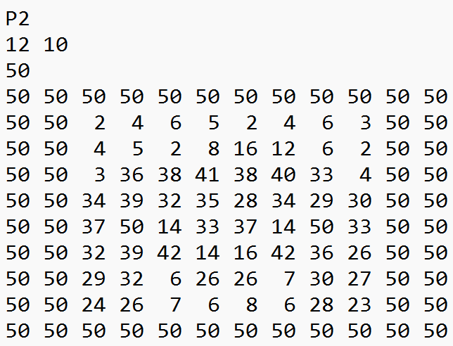
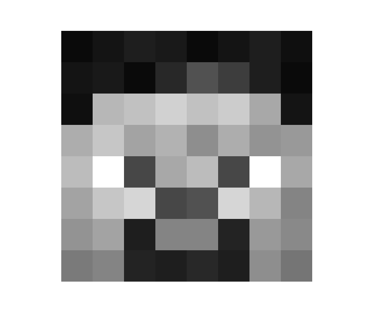
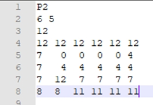
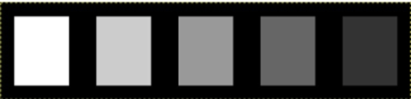
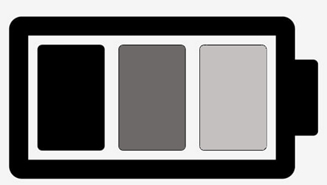

#  Activité 3 - Coder une image en nuances de gris

1. Se connecter à l’ENT (avec ses identifiants élèves), et aller sur l’application CAPYTALE.

2. Aller dans la rubrique “Mes Activités” et entrer le numéro d’exercice suivant : **332e-4916712**

## Tutoriel : les bases du codage en niveau de gris

Difficile de rendre une image attrayante avec seulement le noir et le blanc. Le format PGM (Portable Grey Map) permet de rendre des dégradés de gris sur une échelle allant de 0 (noir) à 255 (blanc). La structure de l’image est sensiblement la même que pour le PBM, on remplace les 0 et les 1 par les nombres correspondants « au code de gris ».**Plus ce nombre est élevé, plus le gris est proche du blanc**.

??? note "Exemple :"
    {width=49%}
    {width=49%}
    
    **Comment lire ce code ?**

    * En ligne 1 : P2 signifie que l'image sera en niveau de gris

    * En ligne 2 : 12 représente la largeur et 10 la hauteur (en pixels): c'est la définition

    * En ligne 3 : c'est la valeur maximale du niveau de gris. On peut mettre de 0 à 255. Ici le chiffres est 50, ce qui signifie qu'il y 51 nuances de gris (blanc et noir compris ; le blanc sera 50 et le noir 0)

    *  Les lignes suivantes (de 4 à 13) sont le codage à proprement parlé de l'image, les 50 correspondent au blanc et le 0 au noir. ==Plus le chiffre est proche de 0 plus le gris sera foncé.==
 
 
!!! warning "Attention" 
    Pensez à enregistrer régulièrement votre travail en cliquant sur l'icone de la disquette. 
    Il est possible de revenir en arrière en maintenant appuyé les touches ++ctrl+z++

## Exercice 1 : Lire le code d'une image en niveau de gris

Lire le code ci-dessous et répondre aux questions.  
{ .center}

1. Quelle ligne permet de savoir que le fichier sera une image en niveau de gris ?

2. Combien y a-t-il de pixels en hauteur et en largeur ? Combien de pixels comportent l’image au total ?

3. Combien de niveau de gris y -a-t-il ? (on comptera le blanc et le noir comme des niveaux de gris)

4. Combien y aura-t-il de pixels en noirs ? en blancs ? en gris ?

## Exercice 2 : Créer une image en nuances de gris en la codant
Limage ci-dessous est au format PGM visionnée avec GIMP2 :
Les dimensions de cette image sont 30 px de large pour 7 px de haut

Les bords noirs font 1 pixel, les rectangles font 4 pixels de large sur 5 de haut. L’espace noir entre 2 rectangles fait 2 pixels.
{ .center}

1. Combien y a-t-il de nuances de gris en plus du noir et du blanc ?

2. Avec Notepad++, réaliser le codage qui permettrait d'obtenir cette image. Enregistrer votre production dans votre espace personnel sous la forme **nom_exo2.pgm** et l'ouvrir avec GIMP pour vérifier que la figure correspond au modèle.

!!! note "Exemple :"
     **hermoire_exo2.pgm**

!!! warning "Rendu du travail" 
    Vous devez enregistrer votre frise au format **.pbm** comme demandé dans la consigne et dans la vidéo ci-dessus et le déposer dans l'espace en lien à [cette adresse.](https://nuage08.apps.education.fr/index.php/s/pMexfXosgk7JJ2m)

!!! question "Aide vidéo :"
    [Créer et enregistrer un nouveau document avec Notepad++](https://tube-sciences-technologies.apps.education.fr/w/9UQArhCv7ycLymyoPgnkR6)

!!! question "Aide vidéo :"
    [Comment ouvrir GIMP ? Comment ouvrir Notepad++ ?](https://tube-sciences-technologies.apps.education.fr/w/5Q7UKizpVnnpNSYNBshgoj)

## Exercice 3 : Créer un avatar en le codant (BONUS)

Grâce à Notepad++, créer votre propre avatar ou reproduire l'image ci-dessous.
{ .center}

Il n’y pas de limite de taille. *(Attention plus l'image est grande plus le codage sera long, n'hésiter pas à utilise copier coller pour aller plus vite)*
Enregistrer le fichier sous **nom_avatar.pbm** dans votre espace personnel sous la forme nom_prenom_exo3.pgm et l'ouvrir avec GIMP pour vérifier que la figure correspond au modèle.

!!! note "Exemple :"
     **hermoire_avatar.pbm**

**ATTENTION : Votre avatar ne doit pas être le logo d’une marque, ni représenté un signe offensant ou insultant.**

!!! warning "Rendu du travail" 
    Vous devez enregistrer votre frise au format **.pbm** comme demandé dans la consigne et dans la vidéo ci-dessus et le déposer dans l'espace en lien à [cette adresse.](https://nuage08.apps.education.fr/index.php/s/K8HWd8RRDS2smgo)

!!! question "Aide vidéo :"
    [Créer et enregistrer un nouveau document avec Notepad++](https://tube-sciences-technologies.apps.education.fr/w/9UQArhCv7ycLymyoPgnkR6)

!!! question "Aide vidéo :"
    [Comment ouvrir GIMP ? Comment ouvrir Notepad++ ?](https://tube-sciences-technologies.apps.education.fr/w/5Q7UKizpVnnpNSYNBshgoj)

Réalisé par Christophe Bonvin (CC-BY-NC-SA)
