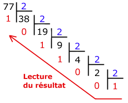

# Cours - Le langage binaire

## I. Principe

Dans notre environnement il y a pleins de données (sons, images, température, dates, etc). Il faut les transcrire (coder) dans un langage adapté pour les machines.
C’est le langage (codage) **binaire**.

Dans les machines, il y a des circuits qui peuvent être alimentés ou non :

* Si le courant passe : c’est la valeur **1**.

* Sinon c’est la valeur **0**.

Il n’y a donc que deux valeurs possibles : 0 ou 1. Cette unité, le **Binary Digit** est appelée le **bit**.

!!! danger "Le bit"
    On définit le **bit** comme étant la **plus petite unité d'information** manipulable par une machine numérique.

!!! warning "Problème :"
    1 bit = 2 informations ou deux valeurs (0 ou 1). C’est donc très peu.
    En comparaison, l’alphabet est composé de 26 caractères sans compter les majuscules, les caractères spéciaux, les couleurs, etc.
    On va donc associer les bits pour pouvoir coder plus d’informations.

## II. Du bit à l'octet

L'**octet** (en anglais byte ou B avec une majuscule dans les notations) est une **unité d'information** composée de **8 bits**.
Pour un octet, le plus petit nombre est 0 et le 
plus grand est 255, ce qui représente 256 ( =2^8^ ) 
possibilités de valeurs différentes.

!!! danger "Informations codées par bit"
	De manière générale, on peut dire qu'un nombre $n$ de bits va coder un nombre $2^n$ informations :  
    
 $n$ bits $\rightarrow 2^n$ informations 

## III. Du système décimal au système binaire

Tous nos chiffres habituels peuvent être formés avec **10 chiffres** (de 0 à 9), on dit  qu’ils sont **décimaux** (ou nombres de base 10, notés ~(10)~ ).

On peut les convertir en nombre **binaire** (ou nombres de base 2, notés ~(2)~ ) qui sont formés uniquement avec **2 chiffres** : 0 ou 1.

Il est possible de passer d'une base 10 à une base 2. Voici une vidéo expliquant la méthode : 

<iframe src="https://ladigitale.dev/digiview/inc/video.php?videoId=YiUQxePwyCk&vignette=https://i.ytimg.com/vi/YiUQxePwyCk/hqdefault.jpg&debut=0&fin=474&largeur=200&hauteur=113" allow="autoplay; fullscreen" frameborder="0" width="700" height="394"></iframe>

??? note "Exemple"
    Traduire le nombre 77~(10)~ en binaire :   
    {.center}  
    77~(10)~ = 1001101~(2)~

!!! example "Exercices "

    === "Enoncé"
        Convertir les valeurs décimales suivantes en binaire :

        * 5

        * 56

        * 195

        * 255

    === "Corrigé"

        * 5~(10)~ = 101~(2)~

        * 56~(10)~ = 111000~(2)~

        * 195~(10)~ = 11000011~(2)~

        * 255 ~(10)~ = 11111111~(2)~

## IV. Du système binaire au système décimal

Il est également possible de passer du système décimal au système binaire en réslisant un calcul de conversion. Voici une vidéo expliquant la méthode (à partir de 3min40s) : 

<iframe src="https://ladigitale.dev/digiview/inc/video.php?videoId=YiUQxePwyCk&vignette=https://i.ytimg.com/vi/YiUQxePwyCk/hqdefault.jpg&debut=0&fin=474&largeur=200&hauteur=113;start=122" allow="autoplay; fullscreen" frameborder="0" width="700" height="394"></iframe>

??? note "Exemple"
    Traduire le nombre 110101~(2)~ en binaire :  
    $110101_{(2)} \leftarrow 2^5 \times 1 + 2^4 \times 1 + 2^3 \times 0 + 2^2 \times 1 + 2^1 \times 0 + 2^0 \times 1= 32 + 16 + 0 + 4 + 0 + 1 = 53_{(10)}$

!!! example "Exercices "

    === "Enoncé"
        Convertir les valeurs binaires suivantes en décimal :

        * 1

        * 111

        * 101110

        * 11111110

    === "Corrigé"

        * 1~(2)~ = 1~(10)~

        * 111~(2)~ = 7~(10)~

        * 101110~(2)~ = 46~(10)~

        * 11111110~(2)~ = 254~(10)~