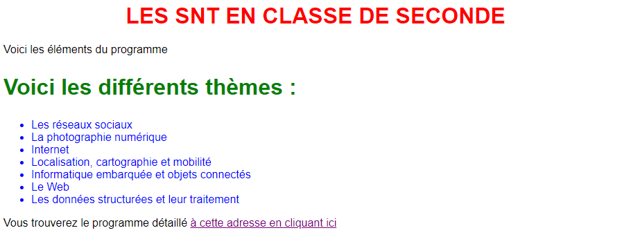

# Activité 3 - Le langage CSS <i class="fa-brands fa-css3-alt" style="color: #016fba;"></i>

## 1. Présentation du langage CSS

Les CSS (Cascading Style Sheets en anglais, ou « feuilles de style en cascade ») sont le code utilisé pour mettre en forme une page web.

Une présentation plus détaillée du langage `CSS` est disponible sur [cette page](../Ressources/Presentation_CSS.md).

## 2. Modifier un fichier CSS pour mettre en page une page Web

1. Se connecter à l’ENT (avec ses identifiants élèves), et aller sur l’application CAPYTALE.

2. Aller dans la rubrique “Mes Activités” et entrer le numéro d’exercice suivant : **844d-4113608**

3. Modifier le contenu du code CSS (et uniquement CSS) pour que la page Web affichée ressemble à ceci :

{ width=600; : .center }

4. Notation :
    * Couleur des titres. (/1)
    * Alignement des titres. (/1)
    * Couleur des paragraphes. (/1)
    * Couleur de la liste. (/1)
    * Couleur du lien internet. (/1) 

5. En cas de difficulté, consulter un fichier d'aide disponible en allant sur [cette page](../Ressources/Presentation_CSS.md).

Réalisé par Christophe Bonvin (CC-BY-NC-SA)