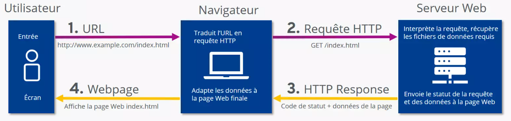

# Cours - le Web

## Historique :
* 1989 : Invention du Web par Tim Berners Lee (ingénieur Britannique)
* 1993 : Premier navigateur Web graphique : Mosaic
* 1994 : Premier achat en ligne (un album de Sting)
* 1997 : 1 million de sites web publiés, les moteurs de recherche sont à la peine
* 1998 : Nouveau moteur de recherche performant : Google
* 2006 : Youtube
* 2007 : commercialisation de l’iPhone qui permet de surfer sur le web
* 2014 : développement de l’HTML 5 (permet de lire les vidéos dans le navigateur) / barre du milliard de site web franchie

## Fonctionnement :
* Le web signifie toile. On le représente comme des points reliés par des fils. Chaque point est une ressource (page web, image ou texte) reliée à d’autres ressources par des fils qui sont les liens hypertexte. **Il ne faut pas confondre internet (qui est un réseau de machines reliées par de la fibre optique) avec le web. Pour fonctionner le web a besoin d’internet mais ce sont deux éléments différents.**

* Pour fonctionner le web repose sur 3 technologies :
    * Le **HTTP** : protocole et de communication entre serveur et client web.
    * Le **HTML** : qui est le langage d’écriture des pages web (actuellement il y a aussi le CSS pour la mise en forme des pages web).
    * L’**URL** : qui permet de donner une adresse unique à chaque page web (et chaque ressource).

{width=800 : .center}

* Un **navigateur web** est un logiciel ou une application qui permet d’afficher les pages web (ex : Firefox, Chrome, Edge, Opéra, Safari, etc). **ATTENTION :** il ne faut pas confondre moteur de recherche et navigateur web. Un moteur de recherche (ex : Bing, Google, Ecosia, etc) sont des sites web qui permettent d’effectuer des recherches.

* **Serveur/Client** : Le client est la machine qui possède le navigateur. L’usager entre l’URL
dans la barre d’adresse du navigateur. Ce dernier envoie une requête (demande) au
serveur web dans le langage http. Si le serveur connaît l’URL, il envoie les fichiers HTML et
CSS au navigateur du client qui va les décoder et afficher la page WEB.

## Les langages du Web

### Le langage HTML

Le langage `HTML` est un langage **balisé**, c’est-à-dire que le contenu est encadré par une **balise ouvrante** `<...>`et une **balise fermante** `</...>`.
> Exemple : 
>Pour un titre : 
>`<h1> Cours de SNT </h1>`  

>`<h1>` est la balise ouvrante  

>`</h1>` est la balise fermante

Il y a 3 balises principales :

* Le `html` qui est la **balise principale** qui contient toutes les balises. Elle indique que la page est codée en HTML.

* Le `head` est la balise qui contient des **informations essentielles** au fonctionnement du navigateur : le lien vers la feuille de style, l’alphabet utilisé, etc... Rien de ce qui est écrit dans le head ne s’affiche sur le navigateur.

* Le `body` qui contient les **informations à faire afficher** sur la page Web. Elle peut contenir d’autres balises.

Pour en savoir plus sur le langage `HTML`, consulter  [cette page](Presentation_HTML.md).

### Le langage CSS

Le langage `CSS` est un langage qui permet de **mettre en forme** les pages web (couleurs, police, alignements, marges, etc.) : on parle de feuille de style.

>Exemple :

>* p est le sélecteur (c’est le nom d’une balise HTML)

>* color est la propriété (ici la couleur)

>* black est la valeur (ici noir)

Pour en savoir plus sur le langage `CSS`, consulter  [cette page](Presentation_CSS.md).

## Les savoir-faire (TP)

* Historique :
    * Savoir replacer des évènements de l’histoire du web sur une frise chronologique
* Le HTML :
    * Savoir lire une page HTML, reconnaître des balises ouvrantes et fermantes
    * Savoir repérer des erreurs de balise dans un code source de page
    * Savoir modifier une page web en ligne avec l’inspecteur de propriété (touche F12)
    * Savoir que la modification d’une page Web en ligne ne modifie pas la page sur le serveur
* Le CSS :
    * Savoir lire un fichier CSS et reconnaître des valeurs en anglais
    * Savoir modifier une feuille de style pour répondre à un cahier des charges
* Lien relatif / Lien absolu :
    * Savoir déterminer le lien absolu d’un fichier dans une arborescence
    * Savoir déterminer le lien relatif d’un fichier dans une arborescence

Réalisé par Christophe Bonvin (CC-BY-NC-SA)