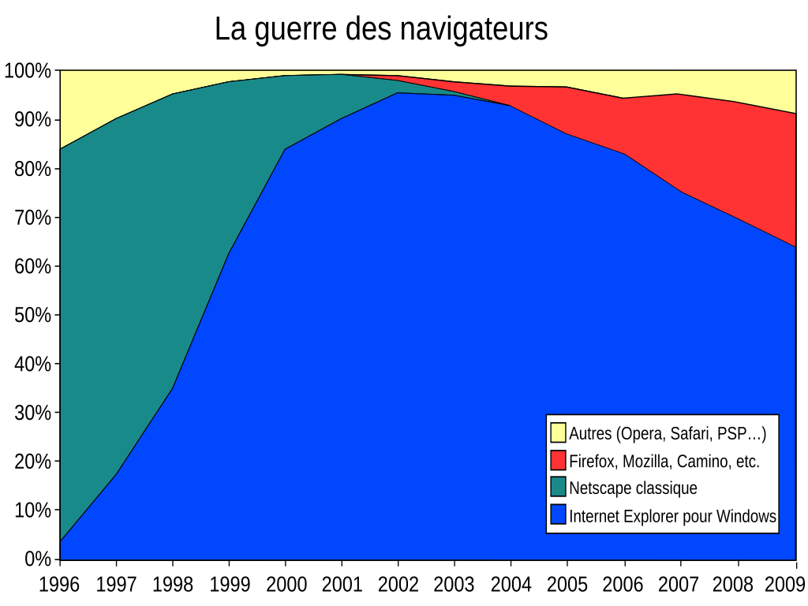

#  La grande toile mondiale

## I. Introduction

Internet est un immense réseau de réseaux. Il existait 18 ans avant la naissance du web et permettait déjà aux machines d'échanger des données... à condition d'être un spécialiste disposant d'un matériel pointu.

Dès 1980, avant la naissance du web, le [minitel](https://fr.wikipedia.org/wiki/Minitel) français donne accès à des services variés préfigurant ceux du futur web, et utilisant pour cela le réseau français [Transpac](https://fr.wikipedia.org/wiki/Transpac)  qui lui-même préfigurait la future infrastructure de transmission d'Internet.

Mais avant 1989, personne n'avait jamais entendu parler du web.

## II. Leçon d'Histoire

### 1989 - 1992 : les débuts

Commençons avec une petite vidéo : 

<iframe src="https://drive.google.com/file/d/1q05NRaCxpZ3y579yLeLcBVet6yJeVxZx/preview" width="720" height="720" frameborder="0" allow="accelerometer; autoplay; clipboard-write; encrypted-media; gyroscope; picture-in-picture" allowfullscreen></iframe> 
Tim Berners-Lee, le génie inventeur du web.

Le chercheur britannique [Tim Berners-Lee](https://fr.wikipedia.org/wiki/Tim_Berners-Lee) a inventé le World Wide Web en **1989**, lorsqu’il travaillait au CERN. À l’origine, le projet a été conçu et développé pour que des scientifiques du monde entier puissent s'échanger des informations instantanément.

Le Belge [Robert Cailliau](https://fr.wikipedia.org/wiki/Robert_Cailliau) le rejoint et ils élaborent ensemble les concepts fondamentaux du Web : Ils décrivent un projet appelé WorldWideWeb, dans lequel un une toile de documents reliés entre eux par des liens hypertextes peuvent être vu par des navigateurs.

Ensemble, ils mettent au point le premier serveur HTTP et le premier client HTTP de l'histoire, c'est à dire le premier site web consultatble par le premier navigateur, vénérable ancêtre de Firefox, Internet Explorer, Chrome, Safari, Edge ou Opéra dont [voici une simulation](https://info.cern.ch/hypertext/WWW/TheProject.html). Oui, il restait du boulot !

Petit à petit de nombreuses universités s'emparent du projet et créent leur propres serveurs également. On dénombre **une trentaine de serveurs et de sites web en 1992**.

### 1993 : l'explosion

C'est en 1993 que le Web va réellement décoller :

* De plus en plus de serveurs se créent : plus de 200 serveurs en fin d'année.

* **Le CERN met le WWW dans le domaine public** : Dorénavant tout le monde peut utiliser l'invention géniale, créer son propre serveur et son propre site web **gratuitement** et **librement**.

* L'université de l’Illinois publie le **premier navigateur graphique [Mosaic](https://fr.wikipedia.org/wiki/NCSA_Mosaic)**. Une page web ressemblait alors à ça :
{ width=600; : .center }

* Les grands groupes de presse commencent alors à publier sur le Web.

### 1994 : la démocratisation

Le web devient de plus en plus grand public à partir de 1994 :

* Une première convention mondiale sur le Web permettra de poser les bases de l'institution dédiée à veiller à l’avenir du Web, le **World Wide Web Consortium**, connu sous l'acronyme [W3C](https://fr.wikipedia.org/wiki/World_Wide_Web_Consortium).

* A la fin de cette année, il y aura plus de 1000 sites et une nouvelle avancée : l'apparition de **[Netscape](https://fr.wikipedia.org/wiki/Netscape_Navigator)**, le premier navigateur graphique pour le grand public.

{ width=600; : .center }

* Les premiers moteurs de recherche comme [Yahoo!](https://fr.wikipedia.org/wiki/Yahoo!) apparaîtront ... et les premières publicités également.

### 1995 : la guerre des navigateurs

* En 1995, Microsoft lance son propre navigateur Internet Explorer, qui sera préinstallé sur tous les pc vendus avec Windows. **La guerre des navigateurs commence**. Pendant de nombreuses années, Internet Explorer sera en situation de quasi-monopole et tentera d'imposer ses propres fonctionnements plutôt que de suivre les normes tandis que Firefox, Safari, Opéra et les autres font de la résistance ...

{ width=600; : .center }

​ Et finissent par le détroner !

{ width=600; : .center }

* Cette année là, le langage de programmation [Javascript](https://fr.wikipedia.org/wiki/JavaScript) pointe le bout de son clic et rend les pages interactives tandis que le [PHP](https://fr.wikipedia.org/wiki/PHP) rend les sites dynamiques : l'internaute peut laisser des messages ou passer des commandes qui sont traitées automatiquement, sans passer par des emails lus par un service clientèle.

* L'arrivée de ces nouveaux langages entraine la naissance du commerce numérique. [Amazon](https://fr.wikipedia.org/wiki/Amazon) n'est encore qu'une librairie en ligne à l'avenir incertain.

### Tout s'emballe !

* **En 1997**, on atteint un million de sites Web. Il n'est plus possible de référencer les sites web existant en utilisant, comme c'était le cas jusque là, des journalistes spécialisés. Les moteurs de recherches existants sont à la peine !

* **En 1998** sort un nouveau moteur de recherche beaucoup plus performant : un certain **Google**. Il est basé sur un algorithme, le [PageRank](https://fr.wikipedia.org/wiki/PageRank) , classant la pertinence de la recherche par autre chose que la simple étude des mots présents sur le site : il intègre le nombre de liens externes visant le site étudié. Il dépasse rapidement ses concurrents.

* **En 2001** :
    * les pages web sont standardisées au niveau mondial.
    * C'est la naissance de [Wikipedia](https://fr.wikipedia.org/wiki/Wikip%C3%A9dia:Accueil_principal), l'extraordinaire encyclopédie collaborative en ligne qui met la connaissance gratuitement à portée de tous, créée par [Jimmy Wales](https://fr.wikipedia.org/wiki/Jimmy_Wales) et [Larry Sanger](https://fr.wikipedia.org/wiki/Larry_Sanger), gloire à eux !

* **En 2004** :
    * Voici **Firefox 1.0**, un navigateur web **libre et gratuit**.
    * **[Facebook](https://fr.wikipedia.org/wiki/Facebook)** sort de l'esprit de [Mark Zuckerberg](https://fr.wikipedia.org/wiki/Mark_Zuckerberg). Si d'autres l'avaient devancé ([Friendster](https://fr.wikipedia.org/wiki/Friendster) en 2002 ou [LinkedIn](https://fr.wikipedia.org/wiki/LinkedIn) en 2003), l'ère des réseaux sociaux démarre vraiment avec lui.
    * [Framasoft](https://framasoft.org/fr/) est réorganisé et voit la création de l'Association **Framasoft** et son site dédié, **visant à valoriser les logiciels libres**.

* **2005**  est parfois vu comme le **début du Web 2.0**, centré sur les internautes eux-mêmes plutôt que sur la documentation disponible. Les internautes créent du contenu, interagissent avec le Web et deviennent ciblés par le marketing.
    * Explosion des blogs, des réseaux sociaux et des [wikis](https://fr.wikipedia.org/wiki/Wiki).
    * Apparition de [Youtube](https://fr.wikipedia.org/wiki/YouTube) qui sera racheté en 2006 par Google qui commence à devenir le monstre qu'il est aujourd'hui.
    * Des nombreux sites très populaires, comme [MegaUpLoad](https://fr.wikipedia.org/wiki/Megaupload), utilisent le web pour diffuser illégallement des documents divers (films, logiciels ...).

* **En 2007** : commercialisation de l'Iphone qui marque le début d'une nouveau type de terminal pour atteindre le Web et surtout apparition d'AppStore qui permet d'utiliser des applications plutôt que de surfer sur le Web. [Cliquez ici pour aller voir la conférence de présentation du premier smartphone de l'histoire](https://www.youtube.com/watch?v=z9w6tO4d90U).

* **En 2008** :
    * Apparition de [Chrome](https://fr.wikipedia.org/wiki/Google_Chrome) : un navigateur web propriétaire développé par Google.
    * Création de la Journée Mondiale contre la Censure sur Internet par Reporters sans frontières. La principale cible de cette manifestation était à l’origine la Chine et ses lois concernant le contrôle d’Internet et du Web.

* **En 2012** :
    * Fermeture de MegaUpLoad par la justice américaine et condamnation de son fondateur.
    * Fin officielle du précurseur mais dépassé Minitel.

* **En 2014**, le W3C décide d’intégrer un système de protection des contenus (notamment vidéos) au sein du HTML5 même si cela va à l'encontre de l'ouverture du Web. La fondation Mozilla cède sous peine de voir le Web se fractionner.

    <table>
		<tr>
			<td style="vertical-align:middle;text-align:center"><b>Année</b></td>
			<td style="vertical-align:middle;text-align:center"><b>Nombre de sites web construits</b></td>
		</tr>
        <tr>
			<td style="vertical-align:middle;text-align:center">1991 (aoüt)</td>
			<td style="vertical-align:middle;text-align:center">1</td>
		</tr>
        <tr>
			<td style="vertical-align:middle;text-align:center">1991</td>
			<td style="vertical-align:middle;text-align:center">10</td>
		</tr>
        <tr>
			<td style="vertical-align:middle;text-align:center">1992</td>
			<td style="vertical-align:middle;text-align:center">263</td>
		</tr>
        <tr>
			<td style="vertical-align:middle;text-align:center">1993</td>
			<td style="vertical-align:middle;text-align:center">6237</td>
		</tr>
        <tr>
			<td style="vertical-align:middle;text-align:center">1994</td>
			<td style="vertical-align:middle;text-align:center">10 022</td>
		</tr>
        <tr>
			<td style="vertical-align:middle;text-align:center">1995</td>
			<td style="vertical-align:middle;text-align:center">62 800</td>
		</tr>
        <tr>
			<td style="vertical-align:middle;text-align:center">1997</td>
			<td style="vertical-align:middle;text-align:center">1 000 000</td>
		</tr>
        <tr>
			<td style="vertical-align:middle;text-align:center">2000</td>
			<td style="vertical-align:middle;text-align:center">10 000 000</td>
		</tr>
        <tr>
			<td style="vertical-align:middle;text-align:center">2003 (février)</td>
			<td style="vertical-align:middle;text-align:center">35 863 952</td>
		</tr>
        <tr>
			<td style="vertical-align:middle;text-align:center">2004</td>
			<td style="vertical-align:middle;text-align:center">57 000 000</td>
		</tr>
        <tr>
			<td style="vertical-align:middle;text-align:center">2005</td>
			<td style="vertical-align:middle;text-align:center">74 000 000</td>
		</tr>
        <tr>
			<td style="vertical-align:middle;text-align:center">2006</td>
			<td style="vertical-align:middle;text-align:center">101 000 000</td>
		</tr>
        <tr>
			<td style="vertical-align:middle;text-align:center">2007</td>
			<td style="vertical-align:middle;text-align:center">155 000 000</td>
		</tr>
        <tr>
			<td style="vertical-align:middle;text-align:center">2008</td>
			<td style="vertical-align:middle;text-align:center">186 000 000</td>
		</tr>
        <tr>
			<td style="vertical-align:middle;text-align:center">2009 (novembre)</td>
			<td style="vertical-align:middle;text-align:center">207 316 960</td>
		</tr>
        <tr>
			<td style="vertical-align:middle;text-align:center">2010 (février)</td>
			<td style="vertical-align:middle;text-align:center">233 636 281</td>
		</tr>
        <tr>
			<td style="vertical-align:middle;text-align:center">2011 (avril)</td>
			<td style="vertical-align:middle;text-align:center">312 693 296</td>
		</tr>
        <tr>
			<td style="vertical-align:middle;text-align:center">2012 (janvier)</td>
			<td style="vertical-align:middle;text-align:center">582 716 657</td>
		</tr>
        <tr>
			<td style="vertical-align:middle;text-align:center">2014 (novembre)</td>
			<td style="vertical-align:middle;text-align:center">947 029 805 (dont 177 782 668 actifs)</td>
		</tr>
	</table>

* **En 2015**, Microsoft développe un nouveau moteur de recherche,[Edge](https://fr.wikipedia.org/wiki/Microsoft_Edge), et l'incorpore à toutes les versions de son système d'exploitation.

* L'[internet des objets](https://fr.wikipedia.org/wiki/Internet_des_objets) (IoT) désignant le nombre croissant d'objets connectés à Internet a logiquement donné naissance au [web des objets](https://fr.wikipedia.org/wiki/Web_des_objets) qui intégre tout appareil interrogeable ou contrôlable à distance, dans le monde.

## III. Conclusion

Dans l’histoire de la communication, le Web est une révolution :

* Il a ouvert à tous la possibilité et le droit de publier.

* Il permet une coopération d’une nature nouvelle entre individus et entre organisations : commerce en ligne, création et distribution de logiciels libres multi-auteurs, création d’encyclopédies mises à jour en permanence, etc...

* Il devient universel pour communiquer avec les objets connectés.

Oui, mais ...

* Le Web permet aussi de **diffuser toutes sortes d’informations dont ni la qualité, ni la pertinence, ni la véracité ne sont garanties** et dont **la vérification des sources** n’est pas
toujours facile (Fake news, rumeurs, publicité ...)

* Il conserve des informations, parfois personnelles, accessibles partout sur de longues durées sans qu’il soit facile de les effacer, ce qui pose la question du **droit à l’oubli**.

* Il permet une **exploitation de ses données**, dont les conséquences sociétales sont encore difficiles à estimer : recommandation à des fins commerciales, bulles informationnelles, etc. En particulier, des moteurs de recherche permettent à certains sites d’acquérir de la visibilité sur la première page des résultats de recherche en achetant de la publicité qui apparaîtra parmi les liens promotionnels.

Sources images :

* [Mosaic _ wikipedia _ domaine public](https://commons.wikimedia.org/wiki/File:NCSA_Mosaic_Browser_Screenshot.png)

* [Netscape _ wikipedia _ domaine public](https://commons.wikimedia.org/wiki/File:Netscape_Navigator_2_Screenshot.png)

* [Guerre des navigateur partie 1 _ wikipédia _ CC BY SA](https://commons.wikimedia.org/wiki/File:Browser_Wars_(fr).svg)

* [Guerre des navigateurs _ wikipédia _ CC](https://commons.wikimedia.org/wiki/File:Usage_share_of_web_browsers_(Source_StatCounter).svg)

Réalisé par Bonvin Christophe et Mieszczak Christophe (CC-BY-NC-SA)
